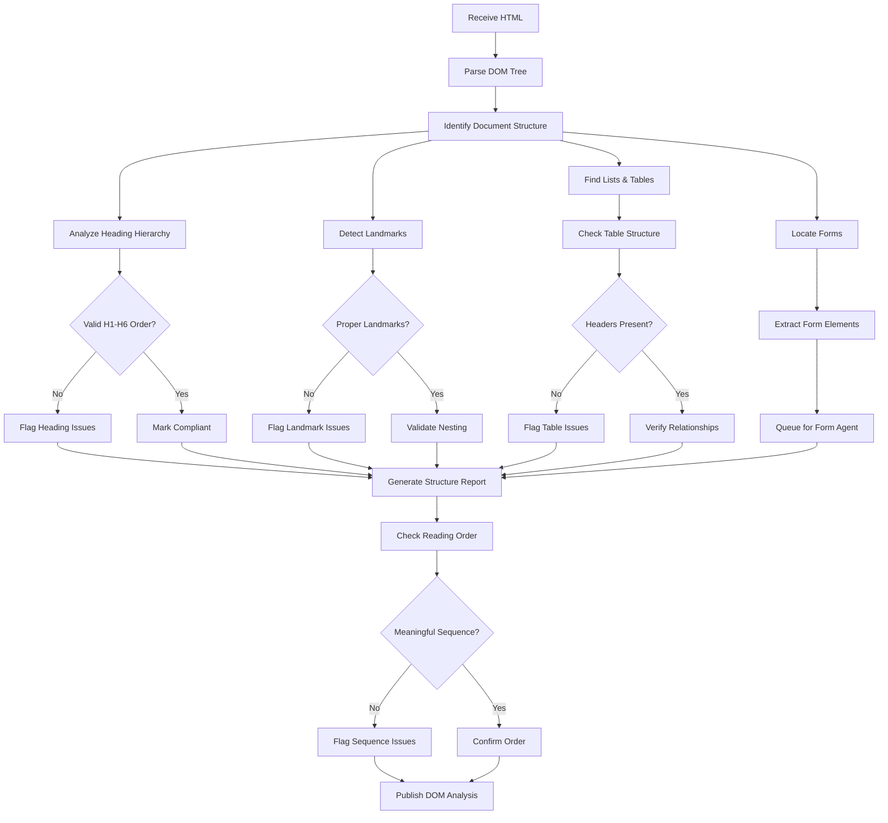

# WCAG AI Agents - Processing Flows and System Prompts

## Table of Contents
1. [Scanner Discovery Agent](#1-scanner-discovery-agent)
2. [DOM Structure Agent](#2-dom-structure-agent)
3. [Visual Analysis Agent](#3-visual-analysis-agent)
4. [Content Analysis Agent](#4-content-analysis-agent)
5. [Media Analysis Agent](#5-media-analysis-agent)
6. [Interaction Testing Agent](#6-interaction-testing-agent)
7. [Form Analysis Agent](#7-form-analysis-agent)
8. [Navigation Analysis Agent](#8-navigation-analysis-agent)
9. [Language & Semantics Agent](#9-language--semantics-agent)
10. [ARIA Validation Agent](#10-aria-validation-agent)
11. [Color & Contrast Agent](#11-color--contrast-agent)
12. [Keyboard Navigation Agent](#12-keyboard-navigation-agent)
13. [Timing & Animation Agent](#13-timing--animation-agent)
14. [Responsive Design Agent](#14-responsive-design-agent)
15. [Scoring Engine Agent](#15-scoring-engine-agent)
16. [Code Generation Agent](#16-code-generation-agent)
17. [Remediation Orchestrator Agent](#17-remediation-orchestrator-agent)
18. [Validation Agent](#18-validation-agent)
19. [Reporting Agent](#19-reporting-agent)
20. [Cognitive Accessibility Agent](#20-cognitive-accessibility-agent)

---

## 1. Scanner Discovery Agent

### Processing Flow


### System Prompts

```yaml
discovery_prompts:
  url_classification: |
    Analyze the following URL and determine its type and priority for accessibility scanning:
    URL: {url}
    
    Consider:
    1. Is this a primary navigation page, content page, or utility page?
    2. Does it contain forms, media, or interactive elements?
    3. What is the likely user traffic to this page?
    4. Are there indicators of dynamic content generation?
    
    Return: {
      "page_type": "navigation|content|form|media|utility",
      "priority": 1-10,
      "expected_elements": ["forms", "videos", "tables", etc.],
      "scan_depth": "shallow|deep|comprehensive"
    }
  
  resource_extraction: |
    Extract all resources from the rendered page that require accessibility analysis:
    
    Identify:
    1. All images, videos, audio files, and embedded media
    2. Forms and input elements
    3. Tables and data structures
    4. Interactive components (modals, accordions, tabs)
    5. Dynamic regions and live content
    6. Third-party widgets and iframes
    7. Downloadable documents (PDF, Word, etc.)
    
    For each resource, determine:
    - Resource type and location
    - Loading mechanism (static, lazy, dynamic)
    - User interaction requirements
    - Relationship to main content
```

---

## 2. DOM Structure Agent

### Processing Flow


### System Prompts

```yaml
dom_analysis_prompts:
  structure_analysis: |
    Analyze the DOM structure for WCAG compliance (1.3.1 Info and Relationships):
    
    Check for:
    1. Proper heading hierarchy (h1-h6 in logical order)
    2. Landmark regions (header, nav, main, footer, aside)
    3. List structures (ul, ol, dl used appropriately)
    4. Table semantics (th, caption, scope attributes)
    5. Form groupings (fieldset, legend)
    6. Quotations and citations (blockquote, cite)
    
    Identify structural issues:
    - Missing or skipped heading levels
    - Improper nesting of elements
    - Visual-only formatting (using divs instead of semantic elements)
    - Missing relationships between associated content
    
    Return detailed findings with specific element selectors and remediation suggestions.

  reading_order_validation: |
    Validate the meaningful sequence of content (1.3.2):
    
    Analyze:
    1. DOM order vs visual presentation order
    2. CSS positioning that may affect reading sequence
    3. Flexbox/Grid layouts and their impact on order
    4. Tabindex values affecting focus order
    
    Ensure:
    - Content makes sense when CSS is disabled
    - Reading order matches visual flow
    - Related content is grouped logically
    - No critical information is lost when linearized
```

---

## 3. Visual Analysis Agent

### Processing Flow


### System Prompts

```yaml
visual_analysis_prompts:
  element_detection: |
    Perform visual analysis on the captured screenshot to identify accessibility issues:
    
    Detect and analyze:
    1. Text blocks and their visual hierarchy
    2. Images (decorative vs informative)
    3. Interactive elements (buttons, links, form controls)
    4. Focus indicators and their visibility
    5. Touch/click targets and their sizes
    6. Visual groupings and relationships
    7. Use of color to convey information
    
    For each element:
    - Determine bounding box coordinates
    - Identify visual characteristics (size, color, contrast)
    - Assess visibility and prominence
    - Check spacing from other interactive elements
    
    Flag potential issues:
    - Text that may not resize properly
    - Missing focus indicators
    - Targets smaller than 24x24 CSS pixels
    - Insufficient spacing between interactive elements

  responsive_analysis: |
    Analyze responsive behavior across viewports (1.4.10 Reflow):
    
    Check at viewports:
    - 320px (mobile)
    - 768px (tablet)
    - 1280px (desktop)
    
    Verify:
    1. No horizontal scrolling at 320px width
    2. Content reflows properly without loss
    3. All functionality remains accessible
    4. Text remains readable without zooming
    5. No content is clipped or overlapped
    
    Identify reflow issues that require remediation.
```

---

## 4. Content Analysis Agent

### Processing Flow


### System Prompts

```yaml
content_analysis_prompts:
  text_quality_assessment: |
    Analyze text content for accessibility and clarity:
    
    Evaluate:
    1. Reading level (3.1.5) - Target 8th grade or below
    2. Use of jargon or technical terms (3.1.3)
    3. Abbreviations and acronyms (3.1.4)
    4. Clear and simple language usage
    5. Sentence and paragraph length
    
    For complex content, suggest:
    - Simplified alternatives
    - Glossary entries
    - Visual aids or examples
    - Breaking into smaller chunks

  link_purpose_analysis: |
    Evaluate link text for clarity (2.4.4 Link Purpose):
    
    Check each link for:
    1. Self-descriptive text (avoid "click here", "read more")
    2. Unique purpose when similar links exist
    3. Context from surrounding content
    4. Programmatic context (aria-label, title)
    
    Flag issues:
    - Ambiguous link text
    - Duplicate text with different destinations
    - Links that rely solely on context
    - Missing or inadequate accessible names

  instruction_accessibility: |
    Verify instructions don't rely on sensory characteristics (1.3.3):
    
    Scan for phrases like:
    - "Click the red button"
    - "The round icon"
    - "On the right side"
    - "The large text"
    
    Ensure instructions include:
    - Multiple identifying characteristics
    - Text labels or descriptions
    - Programmatic relationships
    - Non-visual alternatives
```

---

## 5. Media Analysis Agent

### Processing Flow
```mermaid
graph TD
    A[Receive Media] --> B{Media Type?}
    B -->|Image| C[Image Analysis]
    B -->|Video| D[Video Analysis]
    B -->|Audio| E[Audio Analysis]
    B -->|Animation| F[Animation Analysis]
    
    C --> G[Check Alt Text]
    G --> H{Alt Present?}
    H -->|No| I[Flag Missing Alt]
    H -->|Yes| J[Evaluate Quality]
    
    J --> K{Descriptive?}
    K -->|No| L[Flag Poor Alt]
    K -->|Yes| M[Check Context]
    
    D --> N[Check Captions]
    D --> O[Check Audio Description]
    D --> P[Check Transcript]
    
    N --> Q{Captions Present?}
    Q -->|No| R[Flag Missing Captions]
    Q -->|Yes| S[Verify Sync]
    
    E --> T[Check Transcript]
    T --> U{Transcript Available?}
    U -->|No| V[Flag Missing Transcript]
    U -->|Yes| W[Verify Completeness]
    
    F --> X[Check Animation Control]
    X --> Y{User Control?}
    Y -->|No| Z[Flag Auto-play Issue]
    Y -->|Yes| AA[Check Duration]
    
    All paths --> AB[Media Compliance Report]
```

### System Prompts

```yaml
media_analysis_prompts:
  alt_text_quality: |
    Evaluate image alternative text quality (1.1.1 Non-text Content):
    
    For each image, assess:
    1. Is alt text present and non-empty?
    2. Does it convey the same information as the image?
    3. Is it concise yet descriptive (typically <150 chars)?
    4. For decorative images, is alt="" used?
    5. For complex images, is long description available?
    
    Consider context:
    - Surrounding text that may duplicate information
    - Image function (link, button, information)
    - Whether image contains text that needs to be included
    
    Generate appropriate alt text suggestions when missing or inadequate.

  video_accessibility: |
    Analyze video content for accessibility requirements:
    
    Check for (1.2.1-1.2.5):
    1. Captions for all spoken content
    2. Audio descriptions for important visual information
    3. Transcript availability
    4. Caption synchronization and accuracy
    5. Sign language interpretation (AAA)
    
    For each video:
    - Detect if captions track exists
    - Verify caption format (WebVTT, SRT)
    - Check audio description track
    - Identify visual-only content needing description
    
    Flag videos missing required accessibility features.

  audio_content_analysis: |
    Evaluate audio content accessibility (1.2.1 Audio-only):
    
    Requirements:
    1. Text transcript for audio-only content
    2. Captions for live audio (1.2.4)
    3. Clear audio without background noise (1.4.7)
    
    Verify:
    - Transcript completeness and accuracy
    - Identification of speakers
    - Description of significant sounds
    - Availability of transcript link
```

---

## 6. Interaction Testing Agent

### Processing Flow
```mermaid
graph TD
    A[Load Interactive Page] --> B[Identify Interactive Elements]
    B --> C[Buttons]
    B --> D[Links]
    B --> E[Form Controls]
    B --> F[Custom Widgets]
    
    C --> G[Test Click/Tap]
    D --> G
    E --> H[Test Input Methods]
    F --> I[Test ARIA Patterns]
    
    G --> J{Keyboard Accessible?}
    J -->|No| K[Flag Keyboard Issue]
    J -->|Yes| L[Test Focus Management]
    
    H --> M{All Inputs Work?}
    M -->|No| N[Flag Input Issue]
    M -->|Yes| O[Check Validation]
    
    I --> P{ARIA Correct?}
    P -->|No| Q[Flag ARIA Issue]
    P -->|Yes| R[Test State Changes]
    
    L --> S[Test Tab Order]
    S --> T{Logical Order?}
    T -->|No| U[Flag Tab Order Issue]
    T -->|Yes| V[Check Skip Links]
    
    All paths --> W[Interaction Report]
```

### System Prompts

```yaml
interaction_testing_prompts:
  keyboard_navigation_test: |
    Test keyboard accessibility for all interactive elements (2.1.1 Keyboard):
    
    For each element:
    1. Can it receive keyboard focus?
    2. Can it be activated with Enter/Space?
    3. Is focus visible when received?
    4. Can user navigate away (no keyboard trap)?
    5. Are all functions available via keyboard?
    
    Test patterns:
    - Tab/Shift+Tab navigation
    - Arrow key navigation for grouped items
    - Escape key for dismissible content
    - Enter/Space for activation
    
    Document any mouse-only functionality.

  widget_accessibility: |
    Evaluate custom widget accessibility patterns:
    
    Common patterns to test:
    1. Accordions - Arrow keys, Enter/Space to expand
    2. Tabs - Arrow keys between tabs, Tab to panel
    3. Modals - Focus trap, Escape to close
    4. Menus - Arrow navigation, Escape to close
    5. Carousels - Previous/Next controls, pause option
    6. Date pickers - Full keyboard navigation
    
    Verify:
    - Proper ARIA roles and properties
    - State changes announced to screen readers
    - Focus management on open/close
    - Keyboard shortcuts documented
```

---

## 7. Form Analysis Agent

### Processing Flow
```mermaid
graph TD
    A[Analyze Form] --> B[Identify Form Elements]
    B --> C[Input Fields]
    B --> D[Labels]
    B --> E[Error Messages]
    B --> F[Instructions]
    
    C --> G{Each Input}
    G --> H[Check Label Association]
    H --> I{Label Present?}
    I -->|No| J[Flag Missing Label]
    I -->|Yes| K[Verify Association]
    
    K --> L{Properly Associated?}
    L -->|No| M[Flag Association Issue]
    L -->|Yes| N[Check Programmatic Name]
    
    E --> O[Error Identification]
    O --> P{Errors Clear?}
    P -->|No| Q[Flag Error Issue]
    P -->|Yes| R[Check Error Suggestions]
    
    F --> S[Instruction Clarity]
    S --> T{Instructions Present?}
    T -->|No| U[Flag Missing Instructions]
    T -->|Yes| V[Verify Accessibility]
    
    All paths --> W[Form Compliance Report]
    W --> X[Generate Fix Recommendations]
```

### System Prompts

```yaml
form_analysis_prompts:
  label_validation: |
    Validate form labeling and instructions (3.3.2 Labels or Instructions):
    
    For each form control:
    1. Is there a visible label?
    2. Is label programmatically associated (for/id or aria-labelledby)?
    3. Is label text descriptive and clear?
    4. Are required fields indicated?
    5. Is formatting help provided (date formats, phone numbers)?
    
    Check for:
    - Placeholder text used as sole label (incorrect)
    - Labels that disappear on focus
    - Instructions that are not persistent
    - Required field indicators that rely on color alone

  error_handling_analysis: |
    Evaluate error identification and recovery (3.3.1, 3.3.3):
    
    Test error scenarios:
    1. Missing required fields
    2. Invalid format entries
    3. Out-of-range values
    4. Business logic violations
    
    Verify error handling:
    - Errors clearly identified with text
    - Error messages associated with fields
    - Specific correction suggestions provided
    - Form retains user input after error
    - Success confirmation provided
    
    Check prevention measures (3.3.4):
    - Confirmation for legal/financial transactions
    - Review step before submission
    - Ability to reverse submissions
```

---

## 8. Navigation Analysis Agent

### Processing Flow
```mermaid
graph TD
    A[Analyze Navigation] --> B[Identify Nav Elements]
    B --> C[Main Menu]
    B --> D[Breadcrumbs]
    B --> E[Skip Links]
    B --> F[Search]
    
    C --> G[Check Consistency]
    G --> H{Same Across Pages?}
    H -->|No| I[Flag Inconsistency]
    H -->|Yes| J[Verify Structure]
    
    E --> K[Test Skip Links]
    K --> L{Functional?}
    L -->|No| M[Flag Skip Link Issue]
    L -->|Yes| N[Check Visibility]
    
    D --> O[Breadcrumb Structure]
    O --> P{Proper Hierarchy?}
    P -->|No| Q[Flag Breadcrumb Issue]
    P -->|Yes| R[Check Current Page]
    
    F --> S[Search Accessibility]
    S --> T{Keyboard Accessible?}
    T -->|No| U[Flag Search Issue]
    T -->|Yes| V[Check Results]
    
    All paths --> W[Navigation Report]
```

### System Prompts

```yaml
navigation_analysis_prompts:
  consistency_check: |
    Verify navigation consistency (3.2.3 Consistent Navigation):
    
    Across all pages, check:
    1. Navigation menu in same location
    2. Same order of navigation items
    3. Consistent naming of links
    4. Consistent interaction patterns
    5. Predictable submenu behavior
    
    Flag variations in:
    - Position or layout changes
    - Different link text for same destination
    - Inconsistent menu behaviors
    - Missing navigation on some pages

  skip_link_validation: |
    Validate bypass blocks mechanism (2.4.1 Bypass Blocks):
    
    Requirements:
    1. Skip link as first focusable element
    2. Link becomes visible on focus
    3. Link targets main content accurately
    4. Multiple skip options for complex pages
    
    Test:
    - Keyboard activation of skip links
    - Correct focus movement to target
    - Screen reader announcement
    - Visual indication when activated

  multiple_ways_check: |
    Verify multiple ways to find pages (2.4.5 Multiple Ways):
    
    Check for at least two of:
    1. Site search functionality
    2. Sitemap page
    3. Navigation menu
    4. Table of contents
    5. Related links
    6. Breadcrumb trail
    
    Ensure each method is:
    - Fully accessible
    - Comprehensive in coverage
    - Easy to locate and use
```

---

## 9. Language & Semantics Agent

### Processing Flow
```mermaid
graph TD
    A[Analyze Language] --> B[Check Page Language]
    B --> C{Lang Attribute?}
    C -->|No| D[Flag Missing Language]
    C -->|Yes| E[Validate Language Code]
    
    E --> F{Valid Code?}
    F -->|No| G[Flag Invalid Code]
    F -->|Yes| H[Check Language Changes]
    
    H --> I[Scan Content]
    I --> J{Different Languages?}
    J -->|No| K[Single Language OK]
    J -->|Yes| L[Check Lang Markup]
    
    L --> M{Marked Properly?}
    M -->|No| N[Flag Language Parts]
    M -->|Yes| O[Verify Accuracy]
    
    A --> P[Check Semantics]
    P --> Q[Abbreviations]
    P --> R[Unusual Words]
    P --> S[Pronunciation]
    
    Q --> T{Explained?}
    T -->|No| U[Flag Abbreviations]
    
    All paths --> V[Language Report]
```

### System Prompts

```yaml
language_semantics_prompts:
  language_detection: |
    Analyze language declarations (3.1.1, 3.1.2):
    
    Check:
    1. HTML lang attribute present and valid
    2. Correct language code (ISO 639-1)
    3. Language changes within content marked
    4. Proper use of lang attributes on elements
    
    Detect:
    - Mixed language content without markup
    - Incorrect language codes
    - Missing language declarations
    - Language switches in quotes or examples

  semantic_clarity: |
    Evaluate semantic clarity (3.1.3, 3.1.4, 3.1.6):
    
    Identify and flag:
    1. Unexpanded abbreviations/acronyms
    2. Jargon without definitions
    3. Words with unclear pronunciation
    4. Technical terms without explanation
    
    For each issue, suggest:
    - Expansion on first use
    - Glossary links
    - Pronunciation guides
    - Simplified alternatives
```

---

## 10. ARIA Validation Agent

### Processing Flow
```mermaid
graph TD
    A[Scan ARIA Usage] --> B[Identify ARIA Attributes]
    B --> C[Roles]
    B --> D[Properties]
    B --> E[States]
    
    C --> F{Valid Role?}
    F -->|No| G[Flag Invalid Role]
    F -->|Yes| H[Check Role Rules]
    
    H --> I{Proper Context?}
    I -->|No| J[Flag Context Issue]
    I -->|Yes| K[Verify Children]
    
    D --> L{Valid Properties?}
    L -->|No| M[Flag Invalid Props]
    L -->|Yes| N[Check Requirements]
    
    E --> O{States Appropriate?}
    O -->|No| P[Flag State Issues]
    O -->|Yes| Q[Monitor Updates]
    
    All paths --> R[ARIA Validation Report]
    R --> S[Generate Corrections]
```

### System Prompts

```yaml
aria_validation_prompts:
  role_validation: |
    Validate ARIA roles usage (4.1.2 Name, Role, Value):
    
    For each ARIA role:
    1. Is the role valid per ARIA spec?
    2. Is it used on appropriate element?
    3. Are required child roles present?
    4. Are required properties included?
    5. Does it conflict with native semantics?
    
    Common issues to check:
    - Redundant roles (button on <button>)
    - Invalid role values
    - Missing required children
    - Incorrect role hierarchy
    - Conflicting native/ARIA semantics

  state_property_validation: |
    Validate ARIA states and properties:
    
    Check:
    1. Property values are valid
    2. Required properties present
    3. States update appropriately
    4. No conflicting attributes
    5. Proper spelling and syntax
    
    Monitor dynamic updates:
    - aria-expanded toggles
    - aria-selected changes
    - aria-busy during loading
    - aria-live region updates
    - aria-current for navigation
```

---

## 11. Color & Contrast Agent

### Processing Flow
```mermaid
graph TD
    A[Capture Visual Elements] --> B[Extract Colors]
    B --> C[Text Colors]
    B --> D[Background Colors]
    B --> E[UI Component Colors]
    B --> F[Focus Indicator Colors]
    
    C --> G[Pair with Backgrounds]
    G --> H[Calculate Contrast Ratio]
    
    H --> I{Text Size?}
    I -->|Normal| J{Ratio >= 4.5:1?}
    I -->|Large| K{Ratio >= 3:1?}
    
    J -->|No| L[Flag Low Contrast]
    J -->|Yes| M[Check AAA]
    K -->|No| L
    K -->|Yes| M
    
    E --> N[Non-text Contrast]
    N --> O{Ratio >= 3:1?}
    O -->|No| P[Flag UI Contrast]
    O -->|Yes| Q[Mark Compliant]
    
    F --> R[Focus Contrast]
    R --> S{Sufficient?}
    S -->|No| T[Flag Focus Issue]
    
    All paths --> U[Contrast Report]
    U --> V[Suggest Color Fixes]
```

### System Prompts

```yaml
contrast_analysis_prompts:
  text_contrast_check: |
    Analyze text color contrast (1.4.3 Contrast Minimum, 1.4.6 Enhanced):
    
    For each text element:
    1. Extract foreground color (including opacity)
    2. Determine background color (handle gradients)
    3. Calculate contrast ratio
    4. Determine text size (large = 18pt or 14pt bold)
    
    Requirements:
    - Normal text: 4.5:1 minimum (AA), 7:1 enhanced (AAA)
    - Large text: 3:1 minimum (AA), 4.5:1 enhanced (AAA)
    
    Consider:
    - Text over images or patterns
    - Gradient backgrounds
    - Transparent overlays
    - Disabled state exemptions

  ui_component_contrast: |
    Check non-text contrast (1.4.11 Non-text Contrast):
    
    Analyze contrast for:
    1. Form input borders
    2. Button boundaries
    3. Icon graphics
    4. Data visualization elements
    5. Focus indicators
    
    Requirement: 3:1 ratio against adjacent colors
    
    Special cases:
    - Disabled components exempt
    - Logos and flags exempt
    - Inactive UI elements
    - Decorative elements

  color_meaning_check: |
    Verify color isn't sole information source (1.4.1 Use of Color):
    
    Identify cases where color alone indicates:
    - Links in body text
    - Form validation states
    - Required fields
    - Data categories in charts
    - Status indicators
    
    Ensure additional cues:
    - Underlines for links
    - Icons for status
    - Text labels
    - Patterns in charts
    - Borders or shapes
```

---

## 12. Keyboard Navigation Agent

### Processing Flow
```mermaid
graph TD
    A[Initialize Keyboard Test] --> B[Tab to First Element]
    B --> C[Record Focus Path]
    
    C --> D{Element Focusable?}
    D -->|Yes| E[Test Interaction]
    D -->|No| F[Check If Should Be]
    
    E --> G{Keyboard Operable?}
    G -->|No| H[Flag Keyboard Issue]
    G -->|Yes| I[Test All Functions]
    
    I --> J[Arrow Keys]
    I --> K[Enter/Space]
    I --> L[Escape]
    I --> M[Other Keys]
    
    F --> N{Should Be Focusable?}
    N -->|Yes| O[Flag Missing Focus]
    N -->|No| P[Continue]
    
    All paths --> Q[Next Element]
    Q --> R{More Elements?}
    R -->|Yes| C
    R -->|No| S[Test Tab Traps]
    
    S --> T{Any Traps?}
    T -->|Yes| U[Flag Trap Issues]
    T -->|No| V[Complete Report]
```

### System Prompts

```yaml
keyboard_navigation_prompts:
  comprehensive_keyboard_test: |
    Perform complete keyboard accessibility testing (2.1.1, 2.1.2, 2.1.3):
    
    Test sequence:
    1. Tab through all interactive elements
    2. Shift+Tab to reverse navigate
    3. Enter/Space to activate buttons/links
    4. Arrow keys in grouped controls
    5. Escape to close overlays
    6. Custom keyboard shortcuts
    
    For each element, verify:
    - Receives visible focus
    - All mouse functions available
    - No keyboard traps
    - Logical tab order
    - Skip links functional
    
    Document:
    - Elements unreachable by keyboard
    - Functions requiring mouse
    - Inconsistent key behaviors
    - Missing keyboard shortcuts

  focus_management_test: |
    Test focus management patterns (2.4.3 Focus Order, 2.4.7 Focus Visible):
    
    Scenarios to test:
    1. Modal open/close - focus trapped and returned
    2. Dynamic content - focus preserved or moved logically
    3. Single-page navigation - focus reset appropriately
    4. Form submission - focus to results or errors
    5. Tab panels - focus moves to panel content
    
    Verify:
    - Focus never lost or reset unexpectedly
    - Focus indicators clearly visible
    - Focus order matches visual flow
    - Focus moves to new content appropriately
```

---

## 13. Timing & Animation Agent

### Processing Flow
```mermaid
graph TD
    A[Detect Timed Content] --> B{Time Limits?}
    B -->|Yes| C[Check User Control]
    B -->|No| D[Check Animations]
    
    C --> E{Can Extend/Disable?}
    E -->|No| F[Flag Timing Issue]
    E -->|Yes| G[Verify Mechanism]
    
    D --> H[Auto-playing Content]
    H --> I{Plays > 3 seconds?}
    I -->|Yes| J{Pause Control?}
    I -->|No| K[Check Motion]
    
    J -->|No| L[Flag Auto-play Issue]
    J -->|Yes| M[Verify Accessibility]
    
    K --> N[Motion Detection]
    N --> O{Essential Motion?}
    O -->|No| P{Can Disable?}
    P -->|No| Q[Flag Motion Issue]
    
    A --> R[Flash Detection]
    R --> S{Flashing Content?}
    S -->|Yes| T{< 3 per second?}
    T -->|No| U[Flag Flash Issue]
    
    All paths --> V[Timing Report]
```

### System Prompts

```yaml
timing_animation_prompts:
  time_limit_check: |
    Evaluate time limits and user control (2.2.1 Timing Adjustable):
    
    Identify timed elements:
    1. Session timeouts
    2. Timed forms or quizzes
    3. Auto-advancing content
    4. Temporary messages
    5. Live auctions or sales
    
    Verify users can:
    - Turn off time limits
    - Adjust time limit (10x minimum)
    - Extend time with warning
    
    Exceptions:
    - Real-time events
    - Essential time limits
    - Time limit > 20 hours

  animation_control_check: |
    Check moving/auto-updating content (2.2.2 Pause, Stop, Hide):
    
    For content that:
    - Starts automatically
    - Lasts > 5 seconds
    - Plays parallel to other content
    
    Verify controls to:
    - Pause/play
    - Stop completely
    - Hide from view
    
    Additional checks (2.3.3):
    - Animation from interactions can be disabled
    - Essential animations exempt
    - Preference for reduced motion respected

  flash_threshold_test: |
    Test for seizure-inducing content (2.3.1 Three Flashes):
    
    Analyze for:
    1. Flashing content frequency
    2. Flash area size
    3. Contrast changes
    4. Red flash content
    
    Thresholds:
    - No more than 3 flashes per second
    - Or below general/red flash thresholds
    - Small area exemption (< 10% of viewport)
    
    Flag any potentially dangerous content.
```

---

## 14. Responsive Design Agent

### Processing Flow
```mermaid
graph TD
    A[Test Responsive Behavior] --> B[320px Width]
    A --> C[768px Width]
    A --> D[1920px Width]
    A --> E[Zoom 200%]
    A --> F[Orientation Change]
    
    B --> G{Horizontal Scroll?}
    G -->|Yes| H[Flag Reflow Issue]
    G -->|No| I[Check Functionality]
    
    E --> J{Content Clipped?}
    J -->|Yes| K[Flag Zoom Issue]
    J -->|No| L[Verify Readability]
    
    F --> M{Orientation Locked?}
    M -->|Yes| N{Essential?}
    N -->|No| O[Flag Orientation Issue]
    
    I --> P[Touch Target Size]
    P --> Q{>= 44x44px?}
    Q -->|No| R[Flag Touch Issue]
    
    All paths --> S[Responsive Report]
```

### System Prompts

```yaml
responsive_design_prompts:
  reflow_testing: |
    Test content reflow (1.4.10 Reflow):
    
    At 320px viewport width:
    1. No horizontal scrolling required
    2. All content accessible
    3. All functionality available
    4. Text remains readable
    5. Images scale appropriately
    
    Exceptions:
    - Data tables
    - Diagrams requiring 2D layout
    - Toolbars with many controls
    - Games requiring precise layout
    
    Document reflow failures and suggest fixes.

  zoom_accommodation: |
    Verify zoom functionality (1.4.4 Resize Text):
    
    Test at zoom levels:
    - 200% browser zoom
    - 400% for key content
    - Text-only zoom where available
    
    Ensure:
    - No content clipped or overlapped
    - Functionality remains accessible
    - Horizontal scroll minimized
    - Layout adapts gracefully
    
    Check text spacing override (1.4.12):
    - Line height 1.5x font size
    - Paragraph spacing 2x font size
    - Letter spacing 0.12x font size
    - Word spacing 0.16x font size

  orientation_flexibility: |
    Test orientation support (1.3.4 Orientation):
    
    Verify:
    1. Content available in both orientations
    2. No forced orientation (unless essential)
    3. Functionality consistent
    4. Layout adapts appropriately
    
    Essential orientation examples:
    - Banking check deposit
    - Piano application
    - Slides for projector
    
    Flag unnecessary orientation locks.
```

---

## 15. Scoring Engine Agent

### Processing Flow
```mermaid
graph TD
    A[Receive Issues] --> B[Categorize by WCAG Level]
    B --> C[Level A Issues]
    B --> D[Level AA Issues]
    B --> E[Level AAA Issues]
    
    C --> F[Critical Weight: 1.0]
    D --> G[High Weight: 0.8]
    E --> H[Medium Weight: 0.5]
    
    F --> I[Calculate Impact Score]
    G --> I
    H --> I
    
    I --> J[User Impact Analysis]
    J --> K{Blocks Access?}
    K -->|Yes| L[Severity: Critical]
    K -->|No| M{Degrades Experience?}
    M -->|Yes| N[Severity: Major]
    M -->|No| O[Severity: Minor]
    
    L --> P[Legal Risk Assessment]
    N --> P
    O --> P
    
    P --> Q[Calculate Fix Effort]
    Q --> R{Automated Fix?}
    R -->|Yes| S[Low Effort]
    R -->|No| T{Complex Change?}
    T -->|Yes| U[High Effort]
    T -->|No| V[Medium Effort]
    
    All scores --> W[Priority Matrix]
    W --> X[Generate Score Report]
```

### System Prompts

```yaml
scoring_engine_prompts:
  severity_calculation: |
    Calculate issue severity scores based on:
    
    Impact Factors (40%):
    1. Number of users affected
    2. Severity of barrier created
    3. Availability of workarounds
    4. Critical functionality blocked
    5. Disability types impacted
    
    Legal Risk (30%):
    1. WCAG level violation (A/AA/AAA)
    2. Regulatory requirements
    3. Industry standards
    4. Litigation precedents
    5. Public-facing vs internal
    
    Business Impact (20%):
    1. Page traffic/importance
    2. Conversion path involvement
    3. Brand reputation risk
    4. Customer complaints
    5. Revenue impact
    
    Fix Complexity (10%):
    1. Code change scope
    2. Testing requirements
    3. Design implications
    4. Content updates needed
    5. Third-party dependencies

  priority_matrix_generation: |
    Generate issue prioritization matrix:
    
    Priority Levels:
    P0 - Critical: Fix immediately
    - Blocks essential functionality
    - High legal risk
    - Affects many users
    
    P1 - High: Fix within sprint
    - Major barriers
    - Level A violations
    - Common user paths
    
    P2 - Medium: Fix within month
    - Moderate impact
    - Level AA violations
    - Some users affected
    
    P3 - Low: Fix when possible
    - Minor issues
    - Level AAA items
    - Edge cases
    
    Consider effort vs impact for scheduling.
```

---

## 16. Code Generation Agent

### Processing Flow
```mermaid
graph TD
    A[Receive Issue] --> B{Issue Type?}
    
    B -->|Missing Alt| C[Generate Alt Text]
    B -->|Missing Label| D[Generate Label]
    B -->|Low Contrast| E[Generate Colors]
    B -->|Missing ARIA| F[Generate ARIA]
    B -->|Structure| G[Generate Semantic HTML]
    
    C --> H[Analyze Image Context]
    H --> I[Create Descriptive Text]
    
    D --> J[Analyze Input Purpose]
    J --> K[Create Clear Label]
    
    E --> L[Calculate New Colors]
    L --> M[Maintain Brand Guidelines]
    
    F --> N[Determine Pattern]
    N --> O[Apply ARIA Rules]
    
    G --> P[Convert to Semantic]
    P --> Q[Preserve Styling]
    
    All paths --> R[Validate Generated Code]
    R --> S{Confidence Score}
    S -->|>95%| T[Auto-apply Ready]
    S -->|80-95%| U[Review Suggested]
    S -->|<80%| V[Manual Fix Needed]
    
    T --> W[Generate Patch]
    U --> W
    V --> X[Generate Guidelines]
```

### System Prompts

```yaml
code_generation_prompts:
  alt_text_generation: |
    Generate appropriate alternative text for images:
    
    Context needed:
    1. Image content and purpose
    2. Surrounding text context
    3. Link destination (if applicable)
    4. Decorative vs informative
    
    Guidelines:
    - Informative: Describe content/function
    - Decorative: Use alt=""
    - Complex: Suggest long description
    - Text in image: Include in alt
    - Redundant: Reference context
    
    Format: Concise, descriptive, <150 characters
    
    Example outputs:
    - "Graph showing 25% increase in sales"
    - "CEO Jane Smith speaking at podium"
    - "Submit button"
    - "" (for decorative border)

  semantic_html_conversion: |
    Convert non-semantic HTML to semantic equivalents:
    
    Common conversions:
    <div class="header"> → <header>
    <div class="nav"> → <nav>
    <span onclick> → <button>
    <div class="list"> → <ul>/<ol>
    
    Preserve:
    - Existing IDs and classes
    - Event handlers
    - Data attributes
    - Styling hooks
    
    Add where missing:
    - Proper heading hierarchy
    - List structures
    - Landmark roles
    - Form groupings

  aria_pattern_implementation: |
    Implement correct ARIA patterns for widgets:
    
    Common patterns:
    
    Accordion:
    - role="region" on panel
    - aria-expanded on trigger
    - aria-controls relationship
    
    Tabs:
    - role="tablist", "tab", "tabpanel"
    - aria-selected states
    - aria-controls relationships
    
    Modal:
    - role="dialog"
    - aria-modal="true"
    - aria-labelledby for title
    
    Generate complete, working implementations.
```

---

## 17. Remediation Orchestrator Agent

### Processing Flow


### System Prompts

```yaml
orchestration_prompts:
  dependency_resolution: |
    Analyze fix dependencies and determine order:
    
    Common dependencies:
    1. Structure before ARIA
    2. Labels before error messages  
    3. Landmarks before skip links
    4. Headings before outline
    5. Color system before individual fixes
    
    Consider:
    - DOM hierarchy changes
    - CSS cascade impacts
    - JavaScript event handlers
    - Framework constraints
    - Build process requirements
    
    Generate optimal fix sequence.

  conflict_detection: |
    Detect potential conflicts between fixes:
    
    Check for:
    1. CSS specificity conflicts
    2. JavaScript namespace collisions
    3. HTML ID duplications
    4. ARIA attribute conflicts
    5. Event handler overrides
    
    Resolution strategies:
    - Merge compatible fixes
    - Sequence conflicting fixes
    - Generate unique identifiers
    - Preserve existing functionality
    - Maintain code style

  rollback_planning: |
    Create rollback strategy for each fix:
    
    Include:
    1. Original code snapshot
    2. Change detection points
    3. Validation criteria
    4. Rollback triggers
    5. State restoration steps
    
    Automated rollback on:
    - Validation test failures
    - Performance degradation
    - Functionality breaks
    - Build failures
    - Runtime errors
```

---

## 18. Validation Agent

### Processing Flow
```mermaid
graph TD
    A[Post-Fix Validation] --> B[Re-run Original Tests]
    B --> C{Issues Fixed?}
    C -->|No| D[Mark Fix Failed]
    C -->|Yes| E[Regression Testing]
    
    E --> F[Test Related Features]
    F --> G{New Issues?}
    G -->|Yes| H[Flag Regression]
    G -->|No| I[Cross-browser Test]
    
    I --> J[Chrome]
    I --> K[Firefox]
    I --> L[Safari]
    I --> M[Edge]
    
    J --> N{Pass?}
    K --> N
    L --> N
    M --> N
    
    N -->|All Pass| O[Screen Reader Test]
    N -->|Any Fail| P[Browser-specific Issue]
    
    O --> Q[NVDA]
    O --> R[JAWS]
    O --> S[VoiceOver]
    
    Q --> T{Announced Correctly?}
    R --> T
    S --> T
    
    T -->|Yes| U[Performance Check]
    T -->|No| V[Announcement Issue]
    
    U --> W{Performance OK?}
    W -->|Yes| X[Validation Passed]
    W -->|No| Y[Performance Impact]
    
    All failures --> Z[Validation Report]
```

### System Prompts

```yaml
validation_prompts:
  fix_verification: |
    Verify accessibility fixes are effective:
    
    Re-test original issues:
    1. Run same test that detected issue
    2. Verify issue no longer present
    3. Check fix doesn't partially work
    4. Ensure fix works dynamically
    5. Test edge cases
    
    Additional validation:
    - Fix works across viewport sizes
    - Maintains functionality
    - Preserves user preferences
    - Works with assistive technology
    - Doesn't break JavaScript

  regression_detection: |
    Check for regression issues:
    
    Test areas:
    1. Parent/sibling elements
    2. CSS cascade effects
    3. JavaScript functionality
    4. Tab order changes
    5. Screen reader announcements
    
    Common regressions:
    - Focus order disrupted
    - Styles bleeding to other elements
    - JavaScript errors introduced
    - ARIA relationships broken
    - Layout shifts occurring
    
    Run full page accessibility scan.

  assistive_technology_testing: |
    Validate with screen readers:
    
    Test scenarios:
    1. Element announces correctly
    2. Role and state communicated
    3. Relationships preserved
    4. Interactive feedback works
    5. Live regions update
    
    For each screen reader:
    - Navigate to element
    - Interact if applicable
    - Verify announcements
    - Check reading order
    - Test form mode/browse mode
    
    Document announcement differences.
```

---

## 19. Reporting Agent

### Processing Flow
```mermaid
graph TD
    A[Collect All Data] --> B[Aggregate Results]
    B --> C[Calculate Metrics]
    
    C --> D[Compliance Score]
    C --> E[Issue Summary]
    C --> F[Fix Progress]
    C --> G[Trending Data]
    
    D --> H{Report Type?}
    H -->|Executive| I[High-level Dashboard]
    H -->|Technical| J[Detailed Report]
    H -->|Compliance| K[Audit Documentation]
    H -->|Developer| L[Fix Instructions]
    
    I --> M[Visual Charts]
    J --> N[Issue Details]
    K --> O[WCAG Mapping]
    L --> P[Code Examples]
    
    M --> Q[Generate PDF]
    N --> R[Generate HTML]
    O --> S[Generate XLSX]
    P --> T[Generate Markdown]
    
    All formats --> U[Distribute Reports]
    U --> V[Email]
    U --> W[Dashboard]
    U --> X[API Webhook]
    U --> Y[Slack/Teams]
```

### System Prompts

```yaml
reporting_prompts:
  executive_summary_generation: |
    Create executive accessibility summary:
    
    Include:
    1. Overall compliance score (0-100)
    2. Critical issues count
    3. Legal risk assessment
    4. Progress since last scan
    5. Top 5 issues by impact
    
    Visualizations:
    - Compliance trend graph
    - Issue distribution chart
    - Fix progress timeline
    - Risk heat map
    
    Keep language non-technical and action-oriented.

  technical_report_creation: |
    Generate detailed technical report:
    
    For each issue:
    1. WCAG criterion violated
    2. Specific element/location
    3. Current code snippet
    4. Recommended fix code
    5. Implementation notes
    6. Testing instructions
    
    Organization:
    - Group by WCAG principle
    - Sort by priority
    - Include reproducible steps
    - Link to documentation
    - Provide code examples

  compliance_documentation: |
    Create formal compliance documentation:
    
    Include:
    1. Conformance statement
    2. WCAG criteria checklist
    3. Test methodology
    4. Issue remediation log
    5. Accessibility policy
    
    Format for:
    - Legal requirements
    - Audit trails
    - Vendor assessments
    - Certification needs
    
    Include timestamps and version control.
```

---

## 20. Cognitive Accessibility Agent

### Processing Flow
```mermaid
graph TD
    A[Analyze Cognitive Load] --> B[Content Complexity]
    B --> C[Reading Level]
    B --> D[Instruction Clarity]
    B --> E[Error Recovery]
    B --> F[Task Complexity]
    
    C --> G{Grade Level?}
    G -->|>8| H[Suggest Simplification]
    G -->|<=8| I[Check Clarity]
    
    D --> J[Multi-step Processes]
    J --> K{Clear Steps?}
    K -->|No| L[Flag Process Issue]
    K -->|Yes| M[Check Progress Indicators]
    
    E --> N[Error Message Analysis]
    N --> O{Helpful?}
    O -->|No| P[Improve Error Text]
    O -->|Yes| Q[Check Recovery Path]
    
    F --> R[Authentication Check]
    R --> S{Cognitive Test?}
    S -->|Yes| T{Alternative?}
    T -->|No| U[Flag Auth Issue]
    
    All paths --> V[Cognitive Report]
```

### System Prompts

```yaml
cognitive_accessibility_prompts:
  complexity_assessment: |
    Evaluate cognitive accessibility factors:
    
    Analyze:
    1. Reading complexity (3.1.5)
    2. Instruction clarity (3.3.2)
    3. Error handling (3.3.3)
    4. Memory load reduction (3.3.7)
    5. Consistent patterns (3.2.3, 3.2.4)
    
    Check for:
    - Complex sentences or jargon
    - Multi-step processes without guidance
    - Reliance on memory
    - Inconsistent interactions
    - Time pressure
    - Complex authentication (3.3.8, 3.3.9)
    
    Suggest improvements for cognitive load reduction.

  authentication_accessibility: |
    Verify accessible authentication (3.3.8, 3.3.9):
    
    Check for cognitive function tests:
    - Puzzles or math problems
    - Memory of random strings
    - Object recognition challenges
    - Logic tests
    
    Ensure alternatives:
    - Email/SMS verification
    - Biometric options
    - Support contact option
    - Accessible CAPTCHA alternatives
    
    For password requirements:
    - Allow paste functionality
    - Show/hide password option
    - Clear requirements upfront
    - Password strength indicators

  help_consistency: |
    Verify help and support features (3.3.5, 3.2.6):
    
    Check:
    1. Help available on all pages
    2. Consistent location
    3. Multiple help formats
    4. Context-sensitive help
    5. Contact information
    
    Help formats:
    - Inline instructions
    - Tooltips/popovers
    - Help documentation
    - Video tutorials
    - Live chat/support
    
    Ensure help is findable and usable.
```

---

## Master Orchestration Flow

### Overall System Flow
```mermaid
graph TD
    A[URL Input] --> B[Scanner Discovery Agent]
    B --> C[Parallel Analysis Phase]
    
    C --> D[DOM Structure Agent]
    C --> E[Visual Analysis Agent]
    C --> F[Content Analysis Agent]
    C --> G[Media Analysis Agent]
    C --> H[Form Analysis Agent]
    C --> I[Navigation Analysis Agent]
    
    D --> J[Issue Collection]
    E --> J
    F --> J
    G --> J
    H --> J
    I --> J
    
    J --> K[Specialized Testing Phase]
    
    K --> L[ARIA Validation Agent]
    K --> M[Color & Contrast Agent]
    K --> N[Keyboard Navigation Agent]
    K --> O[Timing & Animation Agent]
    K --> P[Responsive Design Agent]
    K --> Q[Language & Semantics Agent]
    K --> R[Cognitive Accessibility Agent]
    K --> S[Interaction Testing Agent]
    
    All testing --> T[Scoring Engine Agent]
    T --> U[Prioritized Issue Queue]
    
    U --> V[Code Generation Agent]
    V --> W[Remediation Orchestrator Agent]
    W --> X[Validation Agent]
    
    X --> Y{Validation Passed?}
    Y -->|No| V
    Y -->|Yes| Z[Reporting Agent]
    
    Z --> AA[Stakeholder Reports]
    Z --> AB[Developer Tasks]
    Z --> AC[Compliance Docs]
```

## Implementation Notes

### Agent Communication Protocol
```json
{
  "agent_message": {
    "id": "uuid",
    "timestamp": "2024-01-15T10:30:00Z",
    "from_agent": "dom-structure",
    "to_agent": "scoring-engine",
    "message_type": "issue_detected",
    "payload": {
      "issue": {
        "type": "missing_heading_level",
        "wcag_criteria": ["1.3.1", "2.4.6"],
        "severity": "major",
        "element": {
          "selector": "#main > div:nth-child(3)",
          "html": "<div class='section-title'>...</div>",
          "context": "Following h1, should be h2"
        },
        "confidence": 0.98,
        "auto_fixable": true,
        "suggested_fix": {
          "code": "<h2 class='section-title'>...</h2>",
          "description": "Convert div to h2 element"
        }
      }
    },
    "correlation_id": "scan-123",
    "reply_to": "queue://remediation"
  }
}
```

### WCAG Coverage Matrix

This comprehensive agent system ensures complete coverage of all WCAG 2.2 criteria:

- **Level A (32 criteria)**: Full automated detection and remediation for 28, manual review for 4
- **Level AA (24 criteria)**: Full automated detection for all, automated remediation for 20
- **Level AAA (31 criteria)**: Detection for all, selective implementation based on client needs

Each agent is designed to be modular, scalable, and maintainable, with clear interfaces and comprehensive error handling. The system prompts ensure consistent, high-quality analysis and remediation suggestions across all accessibility issues.