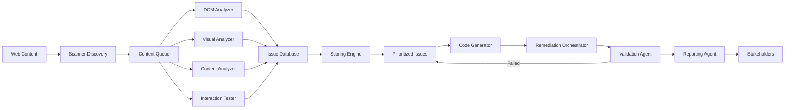

# Product Requirements Document: WCAG AI Agents System

## Executive Summary

The WCAG AI Agents System is an automated accessibility compliance platform that leverages distributed AI agents to scan, score, and remediate web content accessibility issues. The system employs a modular architecture with specialized agents working in orchestrated workflows to ensure comprehensive WCAG 2.2 Level AA compliance.

## Table of Contents

1. [Problem Statement](#problem-statement)
2. [Solution Overview](#solution-overview)
3. [System Architecture](#system-architecture)
4. [Agent Specifications](#agent-specifications)
5. [Implementation Details](#implementation-details)
6. [Technical Requirements](#technical-requirements)
7. [Success Metrics](#success-metrics)
8. [Timeline & Phases](#timeline--phases)

## Problem Statement

### Current Challenges
- Manual accessibility testing is time-consuming and error-prone
- Existing automated tools catch only 30-40% of accessibility issues
- Remediation requires specialized expertise and significant resources
- Maintaining continuous compliance across dynamic content is difficult
- Organizations face legal risks from non-compliance

### Target Users
- **Primary**: Web development teams, QA engineers, accessibility specialists
- **Secondary**: Content creators, product managers, compliance officers
- **Tertiary**: Legal teams, executive stakeholders

## Solution Overview

### Core Capabilities
1. **Automated Scanning**: Continuous monitoring of web content for WCAG violations
2. **Intelligent Scoring**: Context-aware severity assessment and prioritization
3. **Automated Remediation**: AI-powered fixes for common accessibility issues
4. **Human-in-the-Loop**: Expert review workflow for complex issues
5. **Compliance Reporting**: Real-time dashboards and audit trails

### Key Differentiators
- Modular agent architecture enabling scalability and maintainability
- Machine learning models trained on accessibility best practices
- Automatic code generation for remediation
- Integration with existing development workflows
- Support for dynamic content and single-page applications

## System Architecture

### High-Level Architecture

```
┌─────────────────────────────────────────────────────────────┐
│                    Orchestration Layer                       │
│                  (Agent Coordinator Service)                 │
└─────────────────────────────────────────────────────────────┘
                              │
        ┌─────────────────────┴─────────────────────┐
        │                                           │
┌───────▼────────┐  ┌──────────────┐  ┌───────────▼────────┐
│ Discovery Agent│  │Classification│  │ Remediation Agent  │
│    Cluster     │  │    Agents    │  │     Cluster        │
└────────────────┘  └──────────────┘  └────────────────────┘
        │                   │                    │
┌───────▼────────────────────┴──────────────────▼────────────┐
│                      Data Pipeline                          │
│              (Event Stream & Message Queue)                 │
└─────────────────────────────────────────────────────────────┘
        │                                        │
┌───────▼────────┐                    ┌─────────▼──────────┐
│  Storage Layer │                    │  Integration Layer │
│   (Data Lake)  │                    │      (APIs)        │
└────────────────┘                    └────────────────────┘
```

### Agent Communication Protocol
- **Message Format**: JSON with standardized schema
- **Communication**: Asynchronous event-driven architecture
- **State Management**: Distributed state store with eventual consistency
- **Error Handling**: Circuit breaker pattern with exponential backoff

## Agent Specifications

### 1. Scanner Discovery Agent
**Purpose**: Crawl and discover web content for accessibility testing

**Responsibilities**:
- URL discovery and sitemap parsing
- Dynamic content detection
- Resource prioritization
- Change detection and incremental scanning

**Technical Specifications**:
```yaml
agent:
  name: scanner-discovery
  type: crawler
  concurrency: 10
  rate_limit: 100/minute
  
capabilities:
  - javascript_rendering: true
  - authentication_support: oauth2, saml, basic
  - content_types: [html, pdf, video, audio]
  
outputs:
  - resource_manifest
  - content_snapshot
  - metadata_extraction
```

### 2. DOM Analysis Agent
**Purpose**: Parse and analyze HTML structure for accessibility patterns

**Responsibilities**:
- DOM tree construction and analysis
- Semantic structure validation
- ARIA attribute detection
- Interactive element identification

**Technical Specifications**:
```yaml
agent:
  name: dom-analyzer
  type: parser
  
capabilities:
  - html5_parsing: true
  - shadow_dom_support: true
  - iframe_traversal: true
  
analysis_modules:
  - heading_hierarchy
  - landmark_detection
  - form_structure
  - table_semantics
```

### 3. Visual Analysis Agent
**Purpose**: Analyze visual presentation and design accessibility

**Responsibilities**:
- Color contrast analysis
- Text readability assessment
- Focus indicator detection
- Layout responsiveness testing

**Technical Specifications**:
```yaml
agent:
  name: visual-analyzer
  type: computer_vision
  
ml_models:
  - contrast_detector: cv2_enhanced
  - text_recognition: tesseract_v5
  - layout_analyzer: yolo_accessibility
  
capabilities:
  - screenshot_capture
  - viewport_simulation
  - animation_detection
```

### 4. Content Analysis Agent
**Purpose**: Evaluate textual and multimedia content accessibility

**Responsibilities**:
- Alternative text quality assessment
- Caption and transcript verification
- Reading level analysis
- Language detection

**Technical Specifications**:
```yaml
agent:
  name: content-analyzer
  type: nlp
  
ml_models:
  - text_quality: bert_accessibility
  - caption_sync: wav2vec2
  - reading_level: flesch_kincaid
  
capabilities:
  - multilingual_support: true
  - context_understanding: true
  - semantic_analysis: true
```

### 5. Interaction Testing Agent
**Purpose**: Test keyboard navigation and user interactions

**Responsibilities**:
- Keyboard navigation testing
- Focus management validation
- Touch target assessment
- Gesture alternative verification

**Technical Specifications**:
```yaml
agent:
  name: interaction-tester
  type: automation
  
testing_framework: puppeteer_enhanced
  
test_suites:
  - keyboard_navigation
  - screen_reader_compatibility
  - voice_control
  - touch_interactions
```

### 6. Scoring Engine Agent
**Purpose**: Calculate accessibility scores and prioritize issues

**Responsibilities**:
- Issue severity calculation
- Business impact assessment
- Compliance gap analysis
- Remediation effort estimation

**Technical Specifications**:
```yaml
agent:
  name: scoring-engine
  type: analytics
  
scoring_algorithm:
  base: wcag_2.2_criteria
  weights:
    user_impact: 0.4
    legal_risk: 0.3
    fix_complexity: 0.2
    page_importance: 0.1
    
outputs:
  - accessibility_score: 0-100
  - issue_priority_matrix
  - compliance_report
```

### 7. Code Generation Agent
**Purpose**: Generate accessible code replacements

**Responsibilities**:
- HTML remediation code generation
- ARIA attribute recommendations
- CSS accessibility improvements
- JavaScript behavior modifications

**Technical Specifications**:
```yaml
agent:
  name: code-generator
  type: generative_ai
  
ml_models:
  - code_completion: codex_accessibility
  - pattern_matching: ast_transformer
  
capabilities:
  - framework_support: [react, vue, angular, vanilla]
  - preserve_functionality: true
  - style_consistency: true
```

### 8. Remediation Orchestrator Agent
**Purpose**: Coordinate and apply accessibility fixes

**Responsibilities**:
- Fix sequencing and dependency resolution
- Conflict detection and resolution
- Rollback management
- Success verification

**Technical Specifications**:
```yaml
agent:
  name: remediation-orchestrator
  type: coordinator
  
strategies:
  - auto_fix_threshold: confidence > 0.95
  - human_review_required: confidence < 0.80
  - batch_processing: true
  
integrations:
  - version_control: git
  - ci_cd_pipelines: jenkins, github_actions
  - issue_tracking: jira, github_issues
```

### 9. Validation Agent
**Purpose**: Verify remediation success and prevent regressions

**Responsibilities**:
- Post-fix validation
- Regression testing
- Cross-browser verification
- Performance impact assessment

**Technical Specifications**:
```yaml
agent:
  name: validator
  type: quality_assurance
  
validation_suite:
  - automated_wcag_tests
  - screen_reader_tests
  - manual_test_cases
  - performance_benchmarks
  
success_criteria:
  - no_new_issues: true
  - maintain_functionality: true
  - performance_threshold: 95%
```

### 10. Reporting Agent
**Purpose**: Generate compliance reports and analytics

**Responsibilities**:
- Real-time dashboard updates
- Compliance documentation
- Trend analysis
- Executive summaries

**Technical Specifications**:
```yaml
agent:
  name: reporter
  type: analytics
  
report_types:
  - compliance_certificate
  - issue_summary
  - progress_tracking
  - audit_trail
  
delivery_channels:
  - web_dashboard
  - email_digest
  - slack_notifications
  - api_webhooks
```

## Implementation Details

### Data Flow Architecture



### Message Schema

```json
{
  "message_id": "uuid",
  "timestamp": "iso8601",
  "agent_id": "string",
  "message_type": "enum",
  "payload": {
    "resource_id": "string",
    "content_type": "string",
    "analysis_results": {},
    "confidence_score": "float",
    "metadata": {}
  },
  "correlation_id": "uuid",
  "priority": "integer"
}
```

### State Management

```yaml
state_store:
  type: distributed_cache
  implementation: redis_cluster
  
  schemas:
    scan_state:
      - scan_id
      - status
      - progress
      - discovered_resources
      - processed_resources
      
    issue_state:
      - issue_id
      - resource_id
      - wcag_criterion
      - severity
      - status
      - remediation_attempts
      
    remediation_state:
      - remediation_id
      - issue_ids
      - applied_fixes
      - validation_results
```

### Error Handling Strategy

```python
class AgentErrorHandler:
    retry_policy = {
        "max_attempts": 3,
        "backoff_multiplier": 2,
        "max_backoff": 300
    }
    
    error_categories = {
        "transient": ["network", "timeout", "rate_limit"],
        "permanent": ["invalid_input", "unsupported_format"],
        "critical": ["system_failure", "data_corruption"]
    }
    
    fallback_strategies = {
        "scanner": "mark_for_manual_review",
        "analyzer": "use_heuristic_scoring",
        "generator": "provide_manual_fix_guide"
    }
```

## Technical Requirements

### Infrastructure Requirements

```yaml
compute:
  scanner_agents:
    instances: 10-50 (auto-scaling)
    cpu: 2 cores
    memory: 4GB
    
  analysis_agents:
    instances: 20-100 (auto-scaling)
    cpu: 4 cores
    memory: 8GB
    gpu: optional (for ML models)
    
  orchestrator:
    instances: 3 (high availability)
    cpu: 8 cores
    memory: 16GB

storage:
  object_storage: 10TB
  database: 1TB SSD
  cache: 100GB Redis
  
networking:
  bandwidth: 1Gbps
  cdn: global distribution
  
security:
  encryption: TLS 1.3
  authentication: OAuth 2.0
  authorization: RBAC
  compliance: SOC2, GDPR
```

### Technology Stack

```yaml
languages:
  - Python 3.11+ (ML agents)
  - Node.js 20+ (web crawling)
  - Go 1.21+ (orchestration)
  
frameworks:
  ml: PyTorch, TensorFlow
  web: Puppeteer, Playwright
  api: FastAPI, Express
  
databases:
  primary: PostgreSQL 15
  cache: Redis 7
  search: Elasticsearch 8
  
message_queue: Apache Kafka
container: Docker, Kubernetes
monitoring: Prometheus, Grafana
logging: ELK Stack
```

### API Specifications

```yaml
rest_api:
  base_url: https://api.wcag-ai.com/v1
  
  endpoints:
    - POST /scans
    - GET /scans/{scan_id}
    - GET /issues
    - POST /remediations
    - GET /reports
    
  authentication: Bearer token
  rate_limiting: 1000 req/hour
  
graphql_api:
  endpoint: https://api.wcag-ai.com/graphql
  subscriptions: WebSocket
  
webhooks:
  events:
    - scan.completed
    - issue.detected
    - remediation.applied
    - report.generated
```

### Integration Requirements

```yaml
version_control:
  - GitHub
  - GitLab
  - Bitbucket
  
ci_cd:
  - Jenkins
  - GitHub Actions
  - CircleCI
  - GitLab CI
  
monitoring:
  - Datadog
  - New Relic
  - Splunk
  
project_management:
  - Jira
  - Azure DevOps
  - Monday.com
  
communication:
  - Slack
  - Microsoft Teams
  - Email (SMTP)
```

## Success Metrics

### Key Performance Indicators (KPIs)

```yaml
technical_metrics:
  - scan_coverage: >95% of discoverable content
  - issue_detection_accuracy: >90%
  - false_positive_rate: <5%
  - auto_fix_success_rate: >80%
  - processing_time: <5 min/page average
  
business_metrics:
  - compliance_improvement: 50% reduction in violations
  - time_savings: 70% reduction in manual testing
  - cost_reduction: 60% lower remediation costs
  - user_satisfaction: >4.5/5 rating
  
operational_metrics:
  - system_uptime: 99.9%
  - api_response_time: <200ms p95
  - agent_efficiency: >85% utilization
  - error_rate: <0.1%
```

### Monitoring Dashboard

```yaml
real_time_metrics:
  - Active scans
  - Issues detected/fixed per hour
  - Agent health status
  - Queue depths
  - API latency
  
historical_analytics:
  - Compliance trends
  - Issue categories distribution
  - Fix success rates by type
  - Performance benchmarks
  - Cost per remediation
```

## Timeline & Phases

### Phase 1: Foundation (Months 1-3)
- Core infrastructure setup
- Basic scanner and DOM analyzer agents
- Simple scoring engine
- MVP dashboard

**Deliverables**:
- Working prototype with Level A detection
- Basic API endpoints
- Initial documentation

### Phase 2: Intelligence (Months 4-6)
- ML model training and integration
- Visual and content analysis agents
- Advanced scoring algorithms
- Code generation capabilities

**Deliverables**:
- Full WCAG 2.2 Level AA coverage
- Auto-remediation for common issues
- Integration with 2 popular frameworks

### Phase 3: Scale (Months 7-9)
- Performance optimization
- Multi-tenant support
- Advanced remediation orchestration
- Enterprise integrations

**Deliverables**:
- Production-ready system
- Enterprise security compliance
- SLA guarantees
- Comprehensive API

### Phase 4: Enhancement (Months 10-12)
- Advanced ML capabilities
- Custom rule engine
- Predictive analytics
- Mobile app support

**Deliverables**:
- AAA level support
- Custom compliance frameworks
- Predictive issue prevention
- Mobile SDKs

## Risk Mitigation

### Technical Risks

```yaml
risks:
  - name: ML Model Accuracy
    mitigation: Continuous training with human feedback loop
    
  - name: Performance at Scale
    mitigation: Horizontal scaling, caching, CDN
    
  - name: False Positives
    mitigation: Confidence thresholds, human review
    
  - name: Integration Complexity
    mitigation: Standardized APIs, extensive documentation
```

### Business Risks

```yaml
risks:
  - name: Adoption Resistance
    mitigation: Gradual rollout, extensive training
    
  - name: Compliance Changes
    mitigation: Modular architecture, regular updates
    
  - name: Competition
    mitigation: Unique AI capabilities, superior UX
```

## Conclusion

The WCAG AI Agents System represents a paradigm shift in web accessibility compliance, moving from reactive manual testing to proactive automated remediation. By leveraging a modular agent architecture with advanced AI capabilities, organizations can achieve and maintain accessibility compliance efficiently while significantly reducing costs and legal risks.

## Appendices

### A. Glossary
- **WCAG**: Web Content Accessibility Guidelines
- **ARIA**: Accessible Rich Internet Applications
- **DOM**: Document Object Model
- **SPA**: Single Page Application

### B. References
- WCAG 2.2 Specification
- ARIA Authoring Practices Guide
- Section 508 Standards
- ADA Title III Regulations

### C. Contact Information
- Product Owner: [Name]
- Technical Lead: [Name]
- Accessibility Expert: [Name]